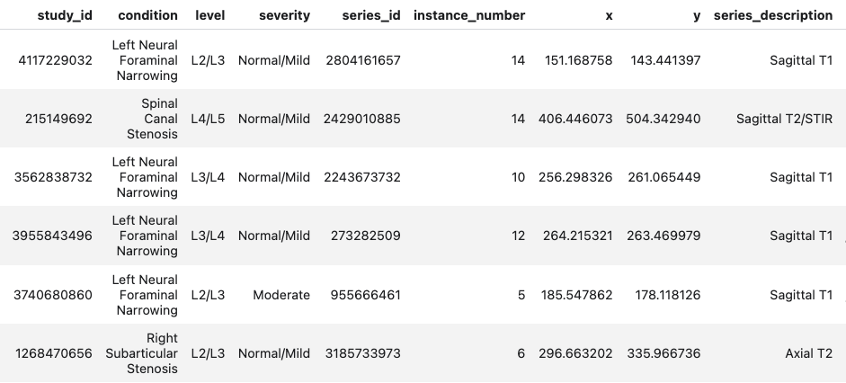
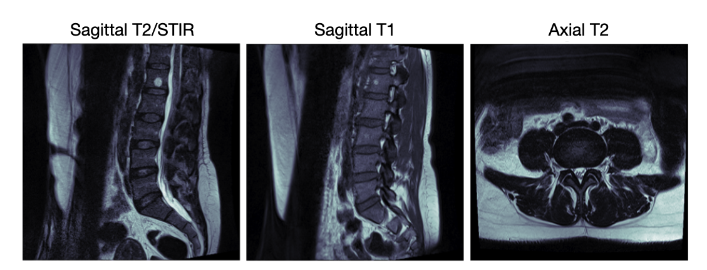

# Lumbar Spine Degenerative Detection and Classification via Computer Vision Models

This repository contains a solution for the Kaggle challenge [RSNA 2024 Lumbar Spine Degenerative Classification](https://www.kaggle.com/competitions/rsna-2024-lumbar-spine-degenerative-classification/overview). The objective is to develop a model framework capable of detecting and classifying degenerative conditions of the lumbar spine using MR images. Included in this repository are the data processing pipeline, model architecture, training procedure, evaluation metrics, and results. The final model is designed to predict the severity levels of five different degenerative conditions. The code is structured to be reproducible, though it is important to note that the analysis pipeline may not fully reflect optimal performance, as limited time and computational resources restricted the ability to thoroughly tune hyperparameters and optimize the model architecture.

## Background

According to the World Health Organization, low back pain is the most common cause of disability worldwide, affecting 619 million people in 2020. Most people experience lower back pain at some point in their lives, and the frequency increases with age. Pain and limitation of movement are often symptoms of spondylosis, characterized by degeneration of the intervertebral discs and resulting compression or irritation of nerves associated with narrowing of the spinal canal (spinal stenosis), subarticular spaces, or neural foramen.

Magnetic resonance imaging (MRI) shows the lumbar spine vertebrae, discs, and nerves in detail, allowing radiologists to assess the presence and severity of these conditions. Accurate diagnosis and grading of these conditions is critical in guiding treatment and possible surgical interventions. It is essential to relieve patients' lower back pain and improve their overall health and quality of life.

For a detailed introduction to the background, please refer to [Anatomy & Image Visualization Overview-RSNA RAIDS](https://www.kaggle.com/code/abhinavsuri/anatomy-image-visualization-overview-rsna-raids)

## Task Overview

RSNA (Radiological Society of North America), in collaboration with ASNR (American Society of Neuroradiology), is organizing this competition to investigate the use of artificial intelligence in detecting and classifying degenerative spine conditions using lumbar spine MR images.

This competition focuses on the classification of five lumbar spine degenerative conditions:

1. Left Neural Foramen Narrowing (LNFN)
1. Right Neural Foramen Narrowing (RNFN)
1. Left Subarticular Stenosis (LSS)
1. Right Subarticular Stenosis (RSS)
1. Spinal Canal Stenosis (SCS)

For each imaging study in the dataset, severity levels (_Normal/Mild, Moderate or Severe_) were provided for each of these five conditions at L1/L2, L2/L3, L3/L4, L4/L5, and L5/S1 intervertebral disc levels.

### Objectives:

This competition aims to develop machine learning models that can accurately classify the severity of degenerative spine conditions based on lumbar spine MRI images. Specifically, the models should:

1. detect the presence of degenerative conditions,
1. classify the severity of these conditions as _Normal/Mild, Moderate or Severe_,
1. perform these tasks at more than one intervertebral disc level.

### Challenges:

1. **Class imbalance**: The dataset used in this study exhibits significant class imbalance, with two of the degenerative spine conditions being underrepresented, e.g., 'Moderate' (16%) and 'Severe' (6%). 
1. **Potential overfitting**: Potential risk of overfitting given the complexity of deep learning models and the relatively small size of the dataset. 
1. **Lack of external validation**: The study does not include external validation using independent datasets from different sources. 
1. **Limited feature engineering**: The current approach primarily relies on raw pixel data from MR images. Additional features such as patient demographics, clinical history, and other relevant metadata could improve the model's predictive performance.

## Data

### Dataset Overview:

The entire dataset is made up of roughly 2000 MR studies, where each study refers to a medical examination of a patient that produces a set of lumbar spine MR images. Spine radiology specialists have provided annotations to indicate the presence, vertebral level and location of any lumbar spine stenosis. There are around 25,000 annotated images in total, with ~23% from LNFN, RNFN and SCS respectively, 22% from LSS and 10% from RSS.

The metadata includes several columns describing key attributes of the medical imaging studies. Following is a snapshot of the metadata table and descriptions of each column:

+ **study_id**: A unique identifier for each medical examination/study (e.g., 4096820034), used to group related images from the same patient visit.
+ **condition**: The diagnosed spinal condition, such as "Spinal Canal Stenosis" or "Left Neural Foraminal Narrowing", indicating the specific pathology identified.
+ **level**: Indicates the specific vertebral levels involved (e.g., L1/L2 through L5/S1), where 'L' represents lumbar vertebrae. The notation shows which adjacent vertebrae are affected.
+ **severity**: Describes the degree of the condition (i.e., Normal/Mild, Moderate, Severe), helping clinicians assess the progression of the disease.
+ **series_id**: A unique identifier for a specific series of images (e.g., 2602265508) within a study, typically representing different imaging sequences or views.
+ **instance_number**: A numerical identifier (e.g., 7, 5, 4) indicating the image's position within a series.
+ **x, y**: Coordinate values indicating specific locations in the images, likely used for annotation or measurement purposes.
+ **series_description**: Describes the type of imaging sequence used (e.g., "Sagittal T2/STIR" or "Sagittal T1"), where:
    + Sagittal refers to the imaging plane (side view)
    + T1 and T2 refer to different MRI weighted sequences
    + STIR (Short TI Inversion Recovery) is a fat-suppression technique used to highlight pathology

The metadata revealed **important** patterns in how different MRI sequences are used for specific conditions. 

+ Sagittal T2/STIR sequences are primarily used for diagnosing Spinal Canal Stenosis , 
+ Sagittal T1 for Left/Right Neural Foraminal Narrowing, 
+ and Axial T2 for Left/Right Subarticular Stenosis. 

This organization reflects standard clinical practices and provides crucial context for developing specialized analysis pipelines for each condition type. We show three examples of the images below, each belongs to a type of MRI sequence:

### Data Preprocessing:

+ Data cleaning and deduplication

    The preprocessing pipeline included thorough data cleaning steps. First, rows with missing severity labels were identified (35 cases, representing 0.07% of the data) and removed to ensure data completeness. A critical deduplication step was implemented to handle multiple coordinates for the same level within an image. Analysis revealed that duplicates were predominantly found in RSS condition (5,457 cases, which deserves further investigation) and mainly affected Axial T2 series images. These duplicates were removed to prevent model confusion during training.

+ Categorical variable encoding

    To facilitate machine learning model development, categorical variables were encoded into numerical formats. Spinal levels were mapped to a 1-5 scale (L1/L2 through L5/S1), and severity levels were encoded on a 0-2 scale (Normal/Mild: 0, Moderate: 1, Severe: 2). This standardization maintains the ordinal nature of these variables while making them suitable for computational analysis.
    

### EDA and Visualization:

A detailed exploratory analysis and visulization on sample sturctures of the data can be found in the notebook [00_processing_and_eda.ipynb](https://github.com/nshen7/rsna-2024/blob/main/notebooks/00_processing_and_eda.ipynb)

## Methodology

### Modeling Pipeline: 

The implemented approach contains two stages:

1. First, **object detection models** are trained to identify five intervertebral disc levels (L1/L2 through L5/S1) in _Sagittal T2/STIR_ images for diagnosing SCS and _Sagittal T1_ images for LNFN/RNFN.
    - The annotated x and y coordinates in the metadata serve as labels for these models.
    - For each condition, a pre-trained [**Faster R-CNN model with a ResNet-50-FPN backbone**](https://pytorch.org/vision/main/models/generated/torchvision.models.detection.fasterrcnn_resnet50_fpn_v2.html) [1] model is fine-tuned independently to predict disc levels.
1. Second, **classification models** are trained to predict the severity level of each condition.
    - Cropped images of intervertebral disc levels are used for SCS, LNFN, and RNFN severity models, while full Axial T2 images are used for LSS/RSS.
    - A pre-trained [**Swin Transformer**](https://pytorch.org/vision/main/models/generated/torchvision.models.swin_v2_t.html) [2] model is fine-tuned for severity prediction task on SCS, LNFN, and RNFN.
    - Due to a small sample size, the model for LSS was fine-tuned from the trained SCS model, which leads to a stronger performance than directly fine-tuning the Swin Transformer on smaller datasets.
    - Due to an even smaller sample size, the model for RSS was fine-tuned from the trained LSS model.

### Train Test Split:

1. To avoid data leakage due to multiple images from same patient, we splitted the dataset into training, validation and test sets according to study IDs so that the patients included in the splits does not overlap.
1. Regarding the cropped images used as input to the severity classification models:
    - For training and inference on validation set, we used images cropped by the annotated coordinates to ensure an optimal classification performance.
    - For inference on test set, we used images cropped by predicted coordiates from the first stage to reflect the actual performance of the entire modeling pipeline.

### Training Strategy: 

- For **all models**:
    - Learning rate: A learning rate of 0.0001 was applied to all object detection models.
    - Optimization method: An ADAM optimizer was applied to all object detection models.
    - Early stopping: the model produced by the epoch that gave the highest accuracy or lowest loss in validation inference was selected as the final model.
- For **object detection models only**:
    - Batch size and epochs: A batch size of 10 and a total epoch of 3 were used for all object detection models.
    - Loss: The combinatorial loss originally proposed in Faster R-CNN was used, which combines a classification cross entropy loss and a bounding box regression loss.
- For **severity classification models only**:
    - Batch size and epochs: A batch size of 50 and a total epoch of 6 were used for all object detection models.
    - Loss: A weighted cross entropy loss was used to address the imbalanced class distribution and prioritize the model's performance on moderate and severe cases. We applied the same sample weights proposed in the evaluation metric of this Kaggle competition:
        - 1 for normal/mild.
        - 2 for moderate.
        - 4 for severe. 

## Summary of Results

- Performance of the disc detection models:
    A detailed performance evaluation on the test set for the disc detection models can be found in the notebook [03_test_disc_detection.ipynb](https://github.com/nshen7/rsna-2024/blob/main/notebooks/03_test_disc_detection.ipynb). Results are reported based on average precision and average recall metrics at various Intersection over Union (IoU) thresholds and sizes of detected areas to assess its ability to localize and classify spinal disc anomalies accurately. In a nutshell, all three models performed well on the test set, resulting in a precision of around 85\~95% for IoU of 0.5 and 0.75 and a recall of 80\~85% for IoU of 0.5:0.95. 
    
- Overall performance of severity classification:
    A detailed performance evaluation on the test set for the entire pipeline can be found in the notebook [05_test_severity_classification.ipynb](https://github.com/nshen7/rsna-2024/blob/main/notebooks/05_test_severity_classification.ipynb). Results are reported based on accuracy, precision, recall, and F1 scores. Our pipeline resulted in an overall loss of 0.5847 and a classification accuracy of 80.90% on the test set across all severity levels, and similar performance was observed across all spinal conditions. In particular, the pipeline performed much better in identifying the Normal/Mild than the Moderate and Severe, which might be due to the limited sample size of the Moderate and Severe classes. See below for the overall accuracy metrics for the three conditions individually:
    - Class 'Normal/Mild': Precision: 0.9174, Recall: 0.8955, F1-score: 0.9063
    - Class 'Moderate':    Precision: 0.4511, Recall: 0.4938, F1-score: 0.4715
    - Class 'Severe':      Precision: 0.4869, Recall: 0.5152, F1-score: 0.5007

## Conclusion and Discussion

This project presents a comprehensive computer vision-based solution for detecting and classifying degenerative conditions of the lumbar spine using MRI images. The proposed two-stage approach, which first localizes the intervertebral disc levels and then classifies the severity of different spinal conditions, has demonstrated promising results on the test set.

However, the two-stage approach presents both advantages and disadvantages. The primary advantage is that the classification models are trained on the most relevant part of the image - the areas surrounding the disc of interest. This targeted approach allows the models to focus on the critical features for accurately classifying the severity of the degenerative conditions. Additionally, the approach is flexible in that the severity classification models can be used on user-provided bounding boxes of a specific intervertebral disc, enabling optimal prediction performance for individual regions of interest.

On the other hand, this approach may lack the ability to leverage common features that are shared across various types of MRI images. By isolating the models to specific disc regions, the framework may miss out on some of the broader contextual information that could be captured by a more holistic model. This tradeoff between localized feature extraction and global understanding represents a potential limitation of the two-stage architecture.

## Limitations and Future work

- **Thorough Hyperparameter tuning:**
    Due to time and resource constraints, we did not thoroughly perform hyperparameter tuning. Optimizing the model's hyperparameters, such as learning rate, batch size, and regularization parameters, could further improve performance. Systematic exploration of the hyperparameter space, using techniques like grid search, random search, or Bayesian optimization, would likely enhance the model’s accuracy and generalization.

- **Data augmentation for improved generalization:**
    Currently, the implementation does not utilize extensive data augmentation techniques. Applying advanced augmentations, such as rotation, scaling, brightness adjustments, and elastic deformations, could introduce greater variability in the training data, helping the model to generalize better to unseen data. Tailoring augmentation methods to medical imaging, like adding noise specific to clinical imaging conditions, could further strengthen model robustness.

- **Utilizing models like MedViT [3] for medical-specific insights:**
    Future iterations could incorporate MedViT, a transformer-based architecture specialized for medical images. MedViT has shown potential for capturing the nuanced features in medical images that general-purpose models may miss. Using it as the base model could leverage its ability to focus on structures and patterns commonly found in medical imaging, possibly improving the accuracy and interpretability of the model.

- **Semi-supervised learning with unlabeled data:**
    The dataset provides a large set of unlabeled images apart from the labeled ones. A promising avenue is the use of semi-supervised learning techniques to leverage the available unlabeled data. By incorporating a semi-supervised approach, the model could benefit from both labeled and unlabeled samples, potentially improving its performance on limited annotated data. Methods like pseudo-labeling and self-training could help exploit the unlabeled data, adding robustness and reducing reliance on labeled data alone.
    
- **Visualization with tools like Grad-CAM:**
    Integrating visualization techniques such as Grad-CAM may enhance model interpretability and provide insights into the decision-making process. By visualizing class-specific activations, we can gain a deeper understanding of the model's behavior and ensure that it is making decisions based on relevant features. This serves as a useful tool to improve the trustworthiness of the model, especially in a medical domain where model explainability is crucial.

## References

1. Ren S, He K, Girshick R, Sun J. Faster R-CNN: Towards Real-Time Object Detection with Region Proposal Networks [Internet]. arXiv; 2016 [cited 2024 Nov 9]. Available from: http://arxiv.org/abs/1506.01497
1. Liu Z, Hu H, Lin Y, Yao Z, Xie Z, Wei Y, et al. Swin Transformer V2: Scaling Up Capacity and Resolution [Internet]. arXiv; 2022 [cited 2024 Nov 10]. Available from: http://arxiv.org/abs/2111.09883
1. Manzari ON, Ahmadabadi H, Kashiani H, Shokouhi SB, Ayatollahi A. MedViT: A Robust Vision Transformer for Generalized Medical Image Classification [Internet]. arXiv; 2023 [cited 2024 Nov 7]. Available from: http://arxiv.org/abs/2302.09462
1. Selvaraju RR, Cogswell M, Das A, Vedantam R, Parikh D, Batra D. Grad-CAM: Visual Explanations from Deep Networks via Gradient-Based Localization. In: 2017 IEEE International Conference on Computer Vision (ICCV) [Internet]. 2017 [cited 2024 Nov 7]. p. 618–26. Available from: https://ieeexplore.ieee.org/document/8237336
1. https://www.kaggle.com/competitions/rsna-2024-lumbar-spine-degenerative-classification/overview
1. https://www.kaggle.com/code/ceng49/84-accuracy-in-spine-classification-using-cnn/notebook
1. https://www.kaggle.com/code/guilhermelevi/rsna-lsdc-disc-detection-baseline-faster-r-cnn
